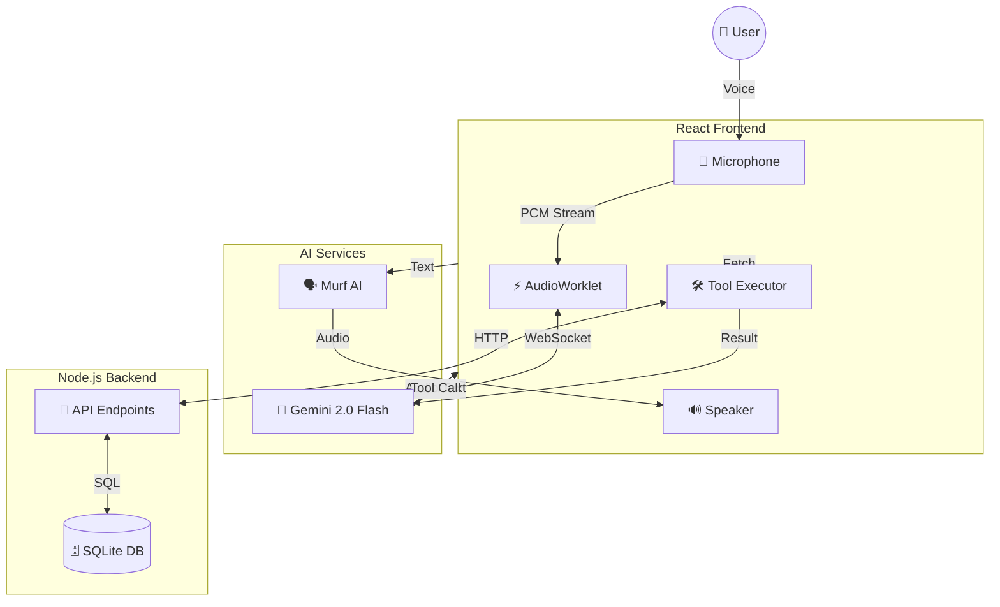

# ⚡ Lumina Support Agent
### Next-Generation Multimodal Voice AI

   

A state-of-the-art customer support agent built with **Gemini 2.0 Flash Native Audio Streaming**, featuring an "Electric Copper" aesthetic, ultra-low latency voice interaction, and real-time agentic capabilities.

---

## 🏗️ Architecture

Lumina represents a paradigm shift in voice AI, moving away from traditional STT->LLM->TTS pipelines to a **native streaming** model.

### Core Components

1.  **🧠 The Brain: Gemini 2.0 Flash**
    *   **Native Audio Streaming**: Processes raw audio input directly without intermediate transcription steps.
    *   **Multimodal**: Capable of understanding text, audio, and visual context simultaneously.
    *   **Tool Use**: Autonomously decides when to call external tools (e.g., checking stock, placing orders).

2.  **🗣️ The Voice: Murf AI**
    *   **High-Fidelity TTS**: Generates ultra-realistic, human-like speech (Voice: *Natalie*).
    *   **Hybrid Pipeline**: Used for specific high-quality responses or greetings, complementing Gemini's native audio.

3.  **💻 Frontend: React + Vite**
    *   **AudioWorklet**: Captures 16kHz PCM audio for low-latency streaming.
    *   **Visuals**: Three.js `DottedSurface` shader for a dynamic, living background.
    *   **UI**: Tailwind CSS 4.0 + Framer Motion for "Electric Copper" glassmorphism.

4.  **🗄️ Backend: Node.js + SQLite**
    *   **Order Management System (OMS)**: A lightweight SQLite database managing Products and Orders.
    *   **API Layer**: Exposes endpoints for the Agent to interact with the database.

---

## 🔄 Workflow Map



---

## 📂 File Structure

```bash
Lumina-Support/
├── client/ (Lumina Support)
│   ├── src/
│   │   ├── components/      # UI Components (DottedSurface, Navbar)
│   │   ├── pages/           # LandingPage, AgentInterface
│   │   ├── services/        # MurfService, AudioUtils
│   │   └── App.tsx          # Routing & Layout
│   └── services/            # External Service Integrations
│
├── server/
│   ├── databaseServer.js    # API & SQLite Logic (Port 3005)
│   ├── server.js            # Legacy Orchestrator (Port 3000)
│   └── lumina.db            # SQLite Database File
```

---

## 🛠️ Agentic Tools

The agent is equipped with specific tools to perform real-world actions:

| Tool Name | Description | Parameters |
| :--- | :--- | :--- |
| `check_stock` | Checks availability and price of a product. | `product_name` |
| `search_order` | Retrieves status and details of an existing order. | `order_id` |
| `place_order` | Creates a new order in the system. | `item_name`, `quantity`, `address` |
| `cancel_order` | Cancels a processing order. | `order_id` |

---

## 🗄️ Database Schema

### `products`
*   `id`: INTEGER PK
*   `name`: TEXT (e.g., "iPhone 15 Pro")
*   `price`: INTEGER
*   `stock`: INTEGER
*   `description`: TEXT

### `orders`
*   `id`: TEXT PK (e.g., "ORD-12345")
*   `customer_name`: TEXT
*   `product_name`: TEXT
*   `status`: TEXT ("Processing", "Shipped", "Delivered", "Cancelled")
*   `delivery_date`: TEXT

---

## 🚀 Setup Guide

### Prerequisites
*   Node.js 18+
*   Google Gemini API Key
*   Murf AI API Key

### 1. Backend Setup (Database)
Initialize the SQLite database and start the API server.

```bash
cd server
npm install
npm run db
```
*Server runs on `http://localhost:3005`*

### 2. Frontend Setup
Start the React application.

```bash
cd "Lumina Support"
npm install
npm run dev
```
*App runs on `http://localhost:5173`*

### 3. Environment Variables
Create a `.env` file in the root of `Lumina Support`:

```env
VITE_GEMINI_API_KEY=your_gemini_key
VITE_MURF_API_KEY=your_murf_key
```

---

## ✨ Key Features

*   **Zero Latency**: Native audio streaming eliminates the "pause" typical of older voice assistants.
*   **Interruptible**: You can speak over the agent, and it will stop and listen immediately.
*   **Context Aware**: Remembers previous turns and maintains conversation flow.
*   **Visual Feedback**:
    *   **Dotted Surface**: Reacts to cursor movement and voice activity.
    *   **Holographic Cards**: Display rich information.
    *   **Tubelight Navbar**: Smooth, glowing navigation.

---

**Built with ❤️ by the Lumina Team**
